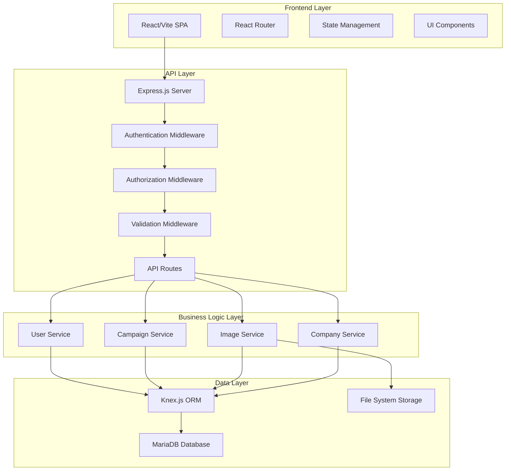

# Design Document

## Overview

The Poster Campaign Management System is a full-stack web application built with React/Vite frontend and Node.js backend. The system manages advertising poster campaigns for multiple clients through a role-based interface supporting Company Employees, Clients, and Contractors. The architecture emphasizes security-first design with server-side validation, role-based access control, and clean separation of concerns.

## Architecture

### System Architecture



### Technology Stack

- **Frontend**: React 18 with Vite for fast development and building
- **Styling**: Tailwind CSS for utility-first responsive design
- **Backend**: Node.js with Express.js framework
- **Database**: MariaDB with Knex.js as query builder/ORM
- **Authentication**: JWT tokens with refresh token rotation
- **File Storage**: Local file system (designed for future cloud migration)
- **Validation**: Joi for server-side input validation
- **Security**: Helmet.js, CORS, rate limiting##
 Components and Interfaces

### Frontend Components

#### Core Layout Components

- **AppLayout**: Main application shell with navigation and role-based menu
- **ProtectedRoute**: Route wrapper that enforces authentication and authorization
- **Navigation**: Role-specific navigation menu component
- **Dashboard**: Landing page component with role-specific content

#### User Management Components

- **UserList**: Display and manage all users (Company Employees only)
- **UserForm**: Create/edit user form with role selection
- **UserProfile**: User profile management for all roles

#### Campaign Management Components

- **CampaignList**: Display campaigns with role-based filtering
- **CampaignForm**: Create/edit campaign form (Company Employees only)
- **CampaignDetail**: Detailed campaign view with image gallery
- **CampaignStatus**: Status management component for campaigns

#### Image Management Components

- **ImageUpload**: Drag-and-drop image upload for contractors
- **ImageGallery**: Display campaign images with approval status
- **ImageReview**: Approve/reject interface for company employees
- **ImageViewer**: Full-size image viewer with metadata

#### Company Management Components

- **CompanyList**: Manage client companies (Company Employees only)
- **CompanyForm**: Create/edit company information
- **CompanyDetail**: Company profile with associated campaigns

### Backend API Interfaces

#### Authentication Endpoints

```typescript
POST /api/auth/login
POST /api/auth/logout
POST /api/auth/refresh
GET /api/auth/me
```

#### User Management Endpoints

```typescript
GET /api/users (Company Employees only)
POST /api/users (Company Employees only)
GET /api/users/:id
PUT /api/users/:id
DELETE /api/users/:id (Company Employees only)
```

#### Company Management Endpoints

```typescript
GET /api/companies (Company Employees only)
POST /api/companies (Company Employees only)
GET /api/companies/:id
PUT /api/companies/:id (Company Employees only)
DELETE /api/companies/:id (Company Employees only)
```

#### Campaign Management Endpoints

```typescript
GET /api/campaigns (role-filtered)
POST /api/campaigns (Company Employees only)
GET /api/campaigns/:id
PUT /api/campaigns/:id (Company Employees only)
DELETE /api/campaigns/:id (Company Employees only)
PUT /api/campaigns/:id/status (Company Employees only)
```

#### Image Management Endpoints

```typescript
GET /api/campaigns/:id/images
POST /api/campaigns/:id/images (Contractors only)
PUT /api/images/:id/approve (Company Employees only)
PUT /api/images/:id/reject (Company Employees only)
DELETE /api/images/:id
GET /api/images/:id/file
```## Data Mo
dels

### Database Schema

#### Users Table
```sql
CREATE TABLE users (
    id INT PRIMARY KEY AUTO_INCREMENT,
    email VARCHAR(255) UNIQUE NOT NULL,
    password_hash VARCHAR(255) NOT NULL,
    first_name VARCHAR(100) NOT NULL,
    last_name VARCHAR(100) NOT NULL,
    role ENUM('company_employee', 'client', 'contractor') NOT NULL,
    company_id INT NULL,
    is_active BOOLEAN DEFAULT TRUE,
    created_at TIMESTAMP DEFAULT CURRENT_TIMESTAMP,
    updated_at TIMESTAMP DEFAULT CURRENT_TIMESTAMP ON UPDATE CURRENT_TIMESTAMP,
    FOREIGN KEY (company_id) REFERENCES companies(id)
);
```

#### Companies Table

```sql
CREATE TABLE companies (
    id INT PRIMARY KEY AUTO_INCREMENT,
    name VARCHAR(255) NOT NULL,
    contact_email VARCHAR(255),
    contact_phone VARCHAR(50),
    address TEXT,
    is_active BOOLEAN DEFAULT TRUE,
    created_at TIMESTAMP DEFAULT CURRENT_TIMESTAMP,
    updated_at TIMESTAMP DEFAULT CURRENT_TIMESTAMP ON UPDATE CURRENT_TIMESTAMP
);
```

#### Campaigns Table

```sql
CREATE TABLE campaigns (
    id INT PRIMARY KEY AUTO_INCREMENT,
    name VARCHAR(255) NOT NULL,
    description TEXT,
    company_id INT NOT NULL,
    status ENUM('new', 'in_progress', 'completed', 'cancelled') DEFAULT 'new',
    start_date DATE,
    end_date DATE,
    completed_at TIMESTAMP NULL,
    created_by INT NOT NULL,
    created_at TIMESTAMP DEFAULT CURRENT_TIMESTAMP,
    updated_at TIMESTAMP DEFAULT CURRENT_TIMESTAMP ON UPDATE CURRENT_TIMESTAMP,
    FOREIGN KEY (company_id) REFERENCES companies(id),
    FOREIGN KEY (created_by) REFERENCES users(id)
);
```

#### Campaign Assignments Table

```sql
CREATE TABLE campaign_assignments (
    id INT PRIMARY KEY AUTO_INCREMENT,
    campaign_id INT NOT NULL,
    contractor_id INT NOT NULL,
    assigned_at TIMESTAMP DEFAULT CURRENT_TIMESTAMP,
    assigned_by INT NOT NULL,
    FOREIGN KEY (campaign_id) REFERENCES campaigns(id),
    FOREIGN KEY (contractor_id) REFERENCES users(id),
    FOREIGN KEY (assigned_by) REFERENCES users(id),
    UNIQUE KEY unique_assignment (campaign_id, contractor_id)
);
```

#### Images Table

```sql
CREATE TABLE images (
    id INT PRIMARY KEY AUTO_INCREMENT,
    campaign_id INT NOT NULL,
    uploaded_by INT NOT NULL,
    filename VARCHAR(255) NOT NULL,
    original_filename VARCHAR(255) NOT NULL,
    file_path VARCHAR(500) NOT NULL,
    file_size INT NOT NULL,
    mime_type VARCHAR(100) NOT NULL,
    status ENUM('pending', 'approved', 'rejected') DEFAULT 'pending',
    rejection_reason TEXT NULL,
    reviewed_by INT NULL,
    reviewed_at TIMESTAMP NULL,
    uploaded_at TIMESTAMP DEFAULT CURRENT_TIMESTAMP,
    FOREIGN KEY (campaign_id) REFERENCES campaigns(id),
    FOREIGN KEY (uploaded_by) REFERENCES users(id),
    FOREIGN KEY (reviewed_by) REFERENCES users(id)
);
```

### TypeScript Interfaces

#### User Interface

```typescript
interface User {
    id: number;
    email: string;
    firstName: string;
    lastName: string;
    role: 'company_employee' | 'client' | 'contractor';
    companyId?: number;
    isActive: boolean;
    createdAt: Date;
    updatedAt: Date;
}
```

#### Campaign Interface

```typescript
interface Campaign {
    id: number;
    name: string;
    description?: string;
    companyId: number;
    status: 'new' | 'in_progress' | 'completed' | 'cancelled';
    startDate?: Date;
    endDate?: Date;
    completedAt?: Date;
    createdBy: number;
    createdAt: Date;
    updatedAt: Date;
    company?: Company;
    assignedContractors?: User[];
    images?: Image[];
}
```

#### Image Interface

```typescript
interface Image {
    id: number;
    campaignId: number;
    uploadedBy: number;
    filename: string;
    originalFilename: string;
    filePath: string;
    fileSize: number;
    mimeType: string;
    status: 'pending' | 'approved' | 'rejected';
    rejectionReason?: string;
    reviewedBy?: number;
    reviewedAt?: Date;
    uploadedAt: Date;
}
```#
# Error Handling

### Frontend Error Handling

#### Error Boundary Component
- Catch and display React component errors gracefully
- Provide fallback UI for broken components
- Log errors for debugging purposes

#### API Error Handling
- Centralized axios interceptor for HTTP error responses
- User-friendly error messages for common scenarios
- Automatic token refresh on 401 errors
- Network error detection and retry mechanisms

#### Form Validation
- Real-time client-side validation for user experience
- Server-side validation errors displayed inline
- Field-level error messages with clear guidance

### Backend Error Handling

#### Global Error Middleware
```typescript
interface ApiError extends Error {
    statusCode: number;
    isOperational: boolean;
}

const errorHandler = (err: ApiError, req: Request, res: Response, next: NextFunction) => {
    const { statusCode = 500, message } = err;
    
    res.status(statusCode).json({
        success: false,
        error: {
            message: process.env.NODE_ENV === 'production' ? 'Internal Server Error' : message,
            ...(process.env.NODE_ENV !== 'production' && { stack: err.stack })
        }
    });
};
```

#### Validation Error Handling

- Joi validation with detailed field-level error messages
- File upload validation (size, type, security)
- Database constraint violation handling
- Authentication and authorization error responses

#### Database Error Handling

- Connection pool management and retry logic
- Transaction rollback on operation failures
- Graceful handling of foreign key constraints
- Duplicate entry error handling with user-friendly messages

## Testing Strategy

### Frontend Testing

#### Unit Testing

- Jest and React Testing Library for component testing
- Test user interactions and state changes
- Mock API calls and external dependencies
- Achieve 80%+ code coverage on critical components

#### Integration Testing

- Test component integration with React Router
- Test form submissions and API interactions
- Test role-based rendering and navigation
- Test file upload functionality

#### End-to-End Testing

- Cypress for critical user workflows
- Test complete user journeys for each role
- Test authentication and authorization flows
- Test image upload and approval processes

### Backend Testing

#### Unit Testing

- Jest for service layer and utility function testing
- Test business logic in isolation
- Mock database operations and external services
- Test input validation and error scenarios

#### Integration Testing

- Test API endpoints with real database
- Test authentication and authorization middleware
- Test file upload and storage operations
- Test database transactions and rollbacks

#### API Testing

- Postman/Newman for API contract testing
- Test all endpoints with various input scenarios
- Test rate limiting and security measures
- Test role-based access control

### Database Testing

- Test migrations and rollbacks
- Test data integrity constraints
- Test performance with large datasets
- Test backup and recovery procedures

### Security Testing

- Test authentication bypass attempts
- Test SQL injection prevention
- Test file upload security (malicious files)
- Test rate limiting and DDoS protection
- Test CORS and XSS prevention
